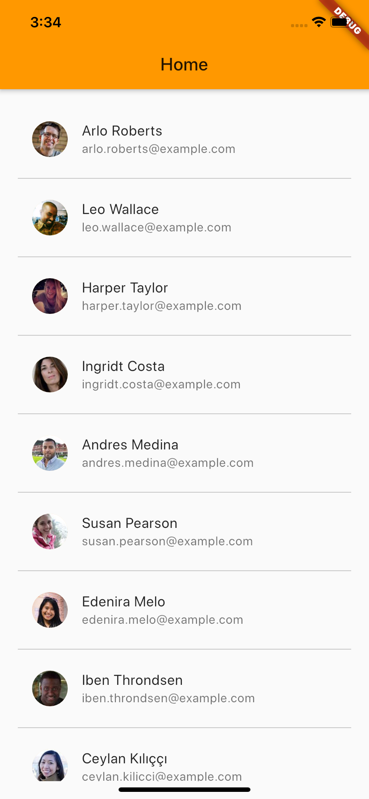

# flutterfly

A sample project used in the live session 'Getting started with Flutter'

  

## Slides
[Slides Link](https://docs.google.com/presentation/d/12WhVi_VA2s0ajP69aCRdaBGC4850t550QxeAhAKeSys/edit?fbclid=IwAR3uAHvogE9DIWGZi__apaKEeijjqiTAkm5OQ_LE-1PMadv0kQIRzlnte7A#slide=id.g745a62d3a6_0_336)

## Connect with me

  

    <a href="https://www.youtube.com/channel/UCAys-Lg76QcRNGc0dOr_bXA">
      
      &nbsp;
      <small>
        SUBSCRIBE to get the latest and greatest content
      </small>
    </a>
  

  

    <a href="https://twitter.com/ahsan_ayz">
      
      &nbsp;
      <small>
        FOLLOW to keep updated with the latest tech trends and news
      </small>
    </a>
  

  

    <a href="https://github.com/ahsanayaz">
      
      &nbsp;
      <small>
        FOLLOW to stay up to date with open-source projects/libraries that I create and work on. 
      </small>
    </a>
  

